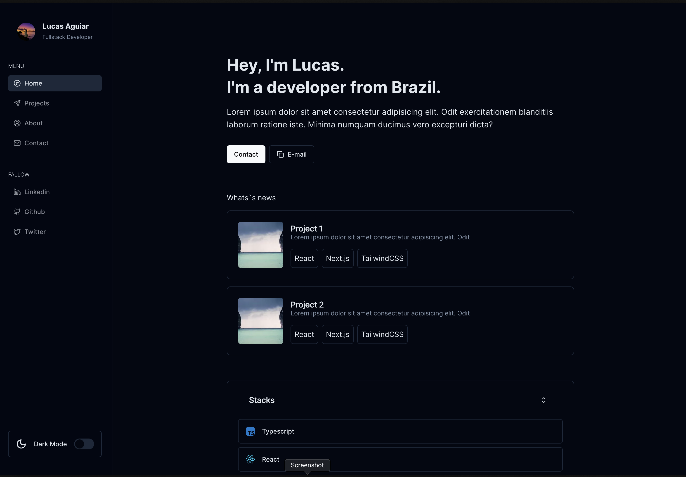

# Portfólio

Este é o repositório do meu site de portfólio, onde apresento meus projetos, informações sobre mim e formas de contato.

## Recursos

- Rota Home: Apresenta uma visão geral do meu trabalho e uma breve introdução.
- Rota Projects: Mostra os projetos que desenvolvi, com detalhes sobre cada um deles.
- Rota About: Fornece informações sobre minha experiência, habilidades e interesses.
- Rota Contact: Permite que os visitantes entrem em contato comigo através de um formulário.
- Modo Dark e Modo Light: Oferece aos usuários a opção de escolher entre temas escuros e claros.

## Demonstração

Uma demonstração do site está disponível [aqui](https://lucas-aguiar.vercel.app).

## Pré-requisitos

Certifique-se de ter o seguinte instalado:

- Node.js (versão 18.16.0)
- pnpm (versão 8.6.1)

## Instalação

1. Clone este repositório: `git clone https://github.com/LucasAguiarr/me.git`
2. Acesse o diretório do projeto: `cd me`
3. Instale as dependências: `pnpm install`

## Uso

1. Inicie o servidor de desenvolvimento: `pnpm dev`
2. Abra o navegador e acesse: `http://localhost:3000`

## Contribuição

Contribuições são bem-vindas! Se você tiver sugestões, melhorias ou encontrar algum problema, fique à vontade para abrir uma issue ou enviar um pull request.

## To-do

- [x] Rota Home
- [x] Rota Projects
- [x] Rota About
- [x] Rota Contact
- [x] Modo Dark
- [x] Modo Light
- [ ] Adicionar animações de transição
- [ ] Otimizar o desempenho
- [ ] Adicionar mais informações aos projetos

## Licença

Este projeto está licenciado sob a licença [MIT]. Para mais informações, consulte o arquivo [LICENSE](LICENSE).

